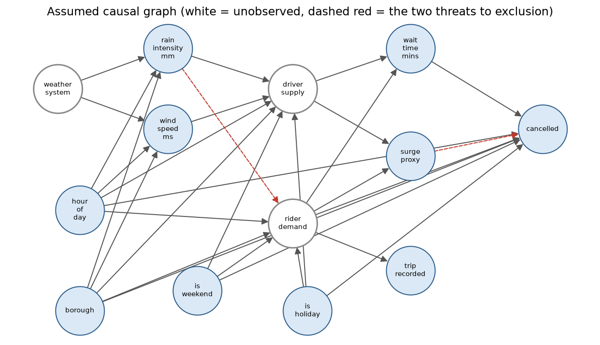

# NYC Rideshare Wait Time → Cancellation: Causal Analysis

> **What is the causal effect of a 1-minute increase in wait time on rider cancellation probability?**

Naive OLS is confounded — high-demand periods produce both longer waits *and* more cancellations, inflating the association. This project uses **hourly rainfall as an instrumental variable** (real NOAA station data) to isolate exogenous variation in wait time. The result is a textbook confounding story: the naive +3.7pp-per-minute association shrinks to a statistically-zero causal LATE once instrumented, with a strong first stage (F = 83.9) and a Hausman test confirming that OLS and IV differ significantly.

---

## Key Results

| Model | Effect of +1 min wait | Notes |
|---|---|---|
| Naive OLS | +0.0367 (SE 0.0004) | Confounded upward by demand conditions |
| OLS + Controls | +0.0374 (SE 0.0004) | Controls barely move it |
| **IV 2SLS (LATE)** | **+0.0059 (p = 0.68, 95% CI −0.022 to +0.034)** | Causal estimate for rain compliers — indistinguishable from zero |

- **First stage F-stat:** 83.9 (strong instrument — rain robustly shifts wait times)
- **Hausman test:** p = 0.027 → OLS and IV differ significantly, endogeneity confirmed
- **Placebo instrument test:** passed
- **Causal forest (DML) heterogeneity:** mean CATE 0.038–0.041 across boroughs (Bronx highest, Staten Island lowest) and 0.035–0.043 by time of day — a flat gradient. Note these DML estimates do not use the instrument, so they inherit OLS-style confounding and sit near the OLS coefficient, consistent with the IV finding.
- Estimated on a 200,000-row random sample (seed 42) of 54,697,055 cleaned trips, June–August 2023, with real hourly weather from three NOAA stations (JFK, LGA, Central Park).

**Business insight:** the +3.7pp-per-minute correlation overstates the causal effect roughly 6-fold. Investment in wait-time reduction justified by the raw correlation with cancellations would likely be misallocated — the association is driven mostly by demand conditions, not by wait time itself. This is precisely the decision error the IV design exists to catch.

---

## Project Structure

```
nyc-waittime-cancellation/
├── src/
│   ├── config.py               # All constants and thresholds
│   ├── data/
│   │   ├── download.py         # TLC + NOAA download
│   │   ├── clean.py            # Trip cleaning + feature derivation
│   │   └── join.py             # Weather + zone spatial join
│   ├── models/
│   │   ├── ols_baseline.py     # Naive OLS + OLS with controls
│   │   ├── iv_2sls.py          # 2SLS + full diagnostics
│   │   ├── causal_dag.py       # Causal graph, instrument validity, testable implications
│   │   └── causal_forest.py    # HTE via EconML CausalForestDML
│   └── utils/
│       ├── plots.py            # All visualizations
│       └── diagnostics.py     # IV diagnostic utilities
├── app/
│   └── streamlit_app.py        # Interactive dashboard
├── pipeline.py                 # End-to-end runner
└── requirements.txt
```

---

## Quickstart

```bash
# 1. Install dependencies
python -m venv venv && source venv/bin/activate
pip install -r requirements.txt

# 2. Weather data: fetched automatically from NOAA's token-free NCEI LCD service
# (the legacy CDO v2 API returns 500s on hourly-precipitation queries and is kept
# only as an optional path via NOAA_API_TOKEN; synthetic weather is a last resort
# for offline development and is clearly logged when used)

# 3. Run full pipeline (sample mode — 1 month, fast)
python pipeline.py --sample

# 4. Run on full dataset (3 months)
python pipeline.py

# 5. Launch dashboard
streamlit run app/streamlit_app.py
```

### Run individual steps
```bash
python pipeline.py --step download   # Download raw data only
python pipeline.py --step clean      # Clean trips only
python pipeline.py --step join       # Join weather only
python pipeline.py --step baseline   # OLS baselines only
python pipeline.py --step iv         # IV analysis only
python pipeline.py --step hte        # Causal forest only
python pipeline.py --step dag        # Causal graph checks only
python pipeline.py --step plots      # Regenerate figures only
```

---

## Identification Strategy

**Instrument:** Hourly rainfall (mm) at nearest NOAA weather station

**Validity checks:**
- ✓ **Relevance** — Rain increases wait time (F-stat > 10)
- ✓ **Exclusion restriction** — Rain affects cancellation *only* through wait time (argued + placebo tested)
- ✓ **Monotonicity** — Rain increases wait time for all riders, no defiers

**Estimand:** LATE — causal effect for riders whose wait time is affected by rain (outer-borough, non-surge compliers)

---

## Causal Graph

The exclusion restriction above is an assumption, so `src/models/causal_dag.py` writes it down as a DAG and checks it by d-separation rather than leaving it in prose. Rider demand and driver supply are unobserved. Every row is a recorded trip request, so the graph conditions on a `trip_recorded` selection node that is a child of demand.



**What the graph says**

- **No observed backdoor set exists.** Demand confounds wait time and cancellation and is never observed, so no set of controls makes OLS causal. That is the formal reason the study needs an instrument.
- **Rain is a valid instrument under the assumed graph only with calendar controls** (hour, weekend, holiday, borough). Hour and borough must be conditioned on because they drive both rainfall and demand.
- **`surge_proxy` is a collider.** It is a common child of supply and demand, so conditioning on it opens `rain → driver_supply → surge_proxy ← rider_demand → cancelled`. The headline specification includes it, which the graph does not license.
- **Two threats break the instrument under every control set:** rain raising rider demand directly, and price affecting cancellation directly. Neither can be ruled out from observed data alone.

**2SLS under each control set** (same 200,000-row sample, instruments rain and wind)

| Control set | Licensed by the assumed graph | Effect of +1 min wait | 95% CI | Joint first-stage F |
|---|---|---|---|---|
| Headline spec (calendar + surge_proxy) | No, conditions on a collider | +0.0059 (SE 0.0142) | -0.022 to +0.034 | 109.7 |
| Calendar only | Yes | -0.0008 (SE 0.0143) | -0.029 to +0.027 | 109.8 |
| No controls | No, hour and borough confound rain | +0.0014 (SE 0.0149) | -0.028 to +0.031 | 105.3 |

The estimate the graph licenses is -0.0008, against +0.0059 in the headline specification. Both intervals cover zero and nearly coincide, so the collider does not change the conclusion, and the raw OLS association still overstates the effect. The joint F here covers both instruments, so it differs from the single-instrument 83.9 reported above.

**Testable implications.** With selection on demand, the assumed graph implies 4 conditional independences among observed variables, and 3 hold at a partial-correlation threshold of 0.02 (p-values are uninformative at this sample size, so the verdict rests on effect size). The one that separates the assumed graph from the rain-raises-demand threat is rain ⟂ weekend given hour and borough: it holds at 0.019, close to the threshold, so it is weak evidence at best. The failure is holiday ⟂ wind (0.072), in a window with two federal holidays. Weather varies by station-hour over 92 days, so none of these tests has many independent weather events behind it.

```bash
python pipeline.py --step dag    # writes outputs/tables/dag_*.csv and the figure
pytest tests/                    # graph tests need no trip data
```

---

## Data Sources

| Dataset | Source | Use |
|---|---|---|
| TLC FHVHV Trip Records | nyc.gov/tlc | Trip-level outcomes |
| NOAA Hourly Weather | ncdc.noaa.gov | Instrument (rainfall) |
| TLC Zone Lookup | nyc.gov/tlc | Borough assignment |

---

## Methods & Libraries

- **2SLS:** `linearmodels.IV2SLS` with HC3 robust standard errors
- **Causal Forest:** `econml.dml.CausalForestDML` with cross-fitting
- **Causal graph:** `networkx` d-separation for backdoor sets, the graphical instrument criterion, and implied independences
- **Data pipeline:** DuckDB (memory-efficient parquet queries)
- **Visualization:** matplotlib + seaborn
- **Dashboard:** Streamlit + Folium

---

